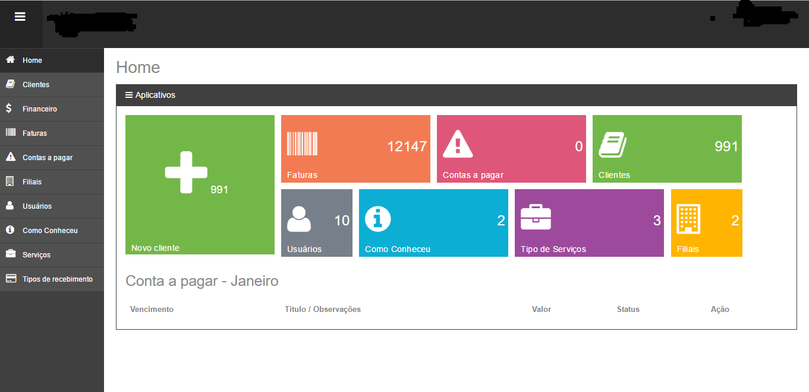

# Gerenciador-financeiro
Gerenciador financeiro para pequenas empresas, possibilidade de adicionar, editar, excluir clientes, faturas, débitos, formas de
pagamentos, emitir boletos, envio por email.

O usuário padrão é teste e a senha é 1234

